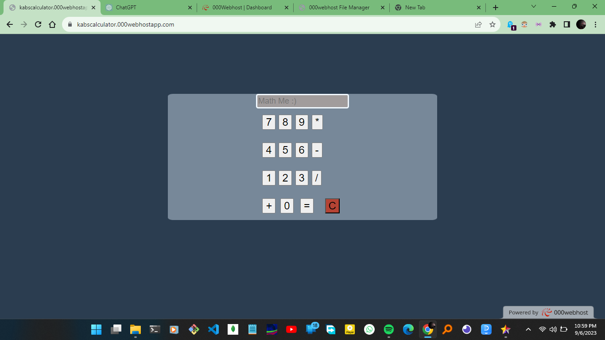
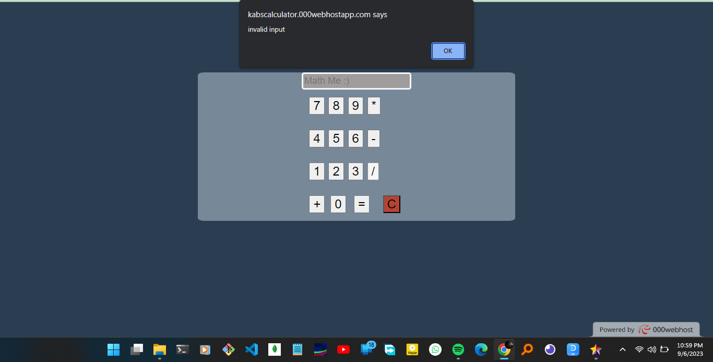

A calculator writen in javascript as the main Language.Which is handling the logic and evaluations. 

Error handling feature included

Check it out here 👇🏾
https://kabscalculator.000webhostapp.com/
